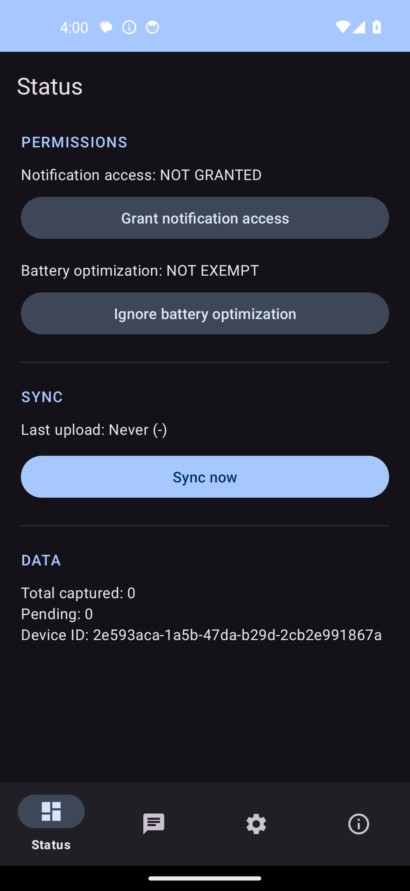
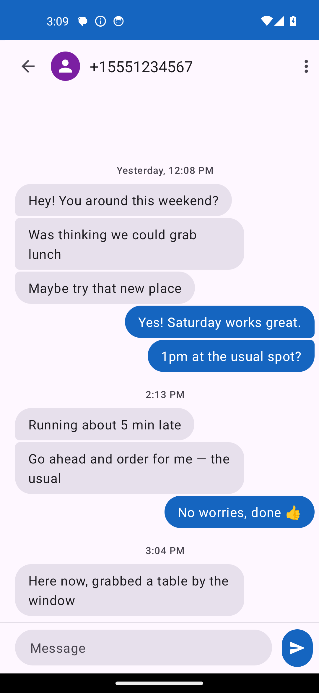
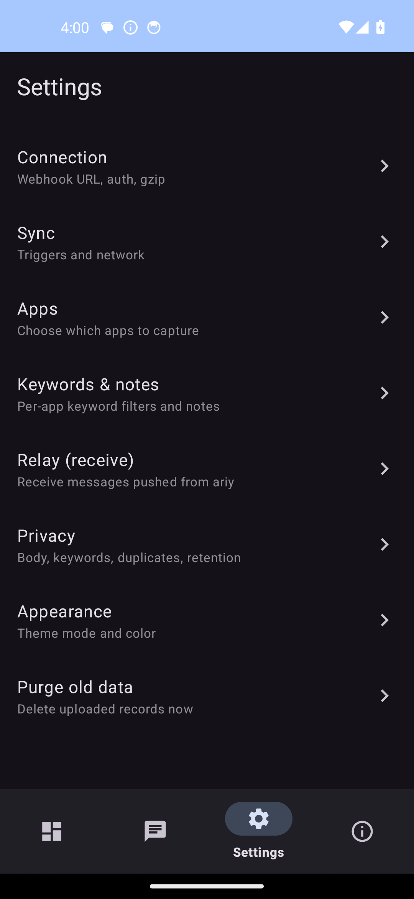

# ariyipp


A lightweight, native-Kotlin Android app that **relays SMS between two of your phones** over an
**end-to-end encrypted** channel. One phone holds the SIM; the other is the one you carry. Incoming
SMS on the SIM phone show up as a chat on your main phone, and you can reply — the SIM phone sends it.

It's **one app with two roles**. Install it on both phones and pick a role on first run (switchable
later): **Main** (the hub you read and reply on) or **Companion** (the SMS phone with the SIM).

## Scope

ariyipp is self-hosted: you run it entirely on your own two phones, on your own [Firebase project](#bring-your-own-firebase-byo-fcm).
This repo doesn't operate a backend, and the maintainer doesn't provide Firebase infrastructure,
service-account credentials, or any hosted service on your behalf — creating your free Firebase
project and importing its two files onto your phones is a one-time step you do yourself. The APK on
[Releases](../../releases) is built and signed by the maintainer for convenience; building from
source with your own signing key (see [below](#build-from-source)) works exactly the same way.

## Screens

| Status | Chat | Settings |
| --- | --- | --- |
|  |  |  |

## Features

- **SMS relay, both directions** — incoming SMS on the companion appear as a searchable, compact chat
  on the main device, with a floating date header, a jump-to-latest button, and real delivery-receipt
  ticks (received by companion / handed to SIM / carrier-confirmed); compose on the main device and
  the companion sends it from its SIM.
- **End-to-end encrypted** — messages are AES-256-GCM encrypted with a pre-shared key; the transport
  (FCM) only ever carries ciphertext.
- **Chat history retention** — how long relayed messages are kept locally is configurable, with old
  ones purged automatically.
- **One-way pairing by QR** — the main device owns and shows the shared key; the companion scans it
  and announces itself back automatically. No copying tokens by hand.
- **Liveness heartbeat** — each device periodically checks the other is reachable and warns (with a
  Retry action) if it goes offline. Toggle it off if you don't want it.
- **Per-conversation mute**, unread badges, one-time-code copy, and inline reply from the notification.
- **Share & multi-select** — share any message to another app (separate from Forward, which relays it
  as SMS through the companion), and bulk mark-as-read/mute/delete conversations from the Messages
  list.
- **Encrypted backup & restore** through the system file picker, passphrase-protected.
- **Optional extras:** capture this phone's notifications and forward them to a webhook, and push the
  webhook config to the companion.
- **Theming:** light/dark/system, Material You, and a true-black AMOLED mode.

## How it works

Both phones run the same app. The **main** device receives relayed messages and shows them as chat;
the **companion** device (with the SIM) observes incoming SMS, encrypts each one, and pushes it to
the main device. Everything travels as ciphertext over Firebase Cloud Messaging (data messages,
high priority so they arrive under Doze).

```
 Companion (SIM)                         Main (hub)
 ──────────────                          ──────────
 incoming SMS  ──encrypt──▶  FCM  ──▶  decrypt ▶ chat + notification
 send from SIM ◀──decrypt──  FCM  ◀──  encrypt ◀ compose / reply
```

Pairing is one-way: the main device generates the shared AES key and shows it (plus its push token)
as a QR; the companion scans it, then announces its own push token back over the encrypted channel,
so reverse-send works with nothing copied by hand.

## Why FCM

The transport is Firebase Cloud Messaging, chosen deliberately to **reuse an existing, free, reliable
push channel** rather than stand up and run new infrastructure. FCM delivers data messages even under
Doze / aggressive battery optimization, costs nothing, and needs no self-hosted push server. The
**send** side isn't even a proprietary SDK: it's a plain HTTP v1 REST call authenticated with a
service-account key.

The catch is the **receive** side, which relies on the proprietary `firebase-messaging` / Google Play
Services library. A [UnifiedPush](https://unifiedpush.org) version (a fully open-source, Firebase-free
build) is on the cards if there's enough demand for it.

## Bring your own Firebase (BYO-FCM)

The app ships **without** any Firebase credentials — nothing is baked in at build time. You create a
free Firebase project and import two files **on-device**, so the relay runs entirely on your project.
Do this once; **both phones use the same project** (and the same two files).

You'll import two files, which do different jobs:

| File | What it's for | Which side uses it |
| --- | --- | --- |
| `google-services.json` | identifies the project so the device can **receive** pushes (get an FCM token) | receive |
| service-account key (JSON) | authorizes this device to **send** pushes to the other one | send |

### 1. Create the project and get `google-services.json`

1. Open the [Firebase console](https://console.firebase.google.com) and click **Add project**. The
   free **Spark** plan is enough — FCM has no usage cost at any scale this app would hit. Give the
   project any name; Google Analytics is optional and can be skipped.
2. On the project's Overview page, click the **Android** icon (**Add app**) to register an app.
   - **Android package name** must be exactly **`com.noti.logger`** — this is baked into the APK
     and has to match precisely for the config file to work.
   - The **SHA-1 field can be left blank** — ariyipp doesn't use any Firebase feature that needs it
     (e.g. Dynamic Links, Phone Auth), only Cloud Messaging.
   - You can stop once the config file downloads; the "add the SDK to your project" steps that
     follow are for app developers building from source, not something you do on the phone.
   - Google's own [Add Firebase to your Android project](https://firebase.google.com/docs/android/setup)
     guide covers this same registration flow in more depth, with its own screenshots, if you want a
     second reference.
3. Download the generated **`google-services.json`** and get it onto the phone (email it to
   yourself, save it to a cloud drive, whatever's convenient) — Settings → Pairing imports it
   directly from wherever you save it.

### 2. Get the service-account key

The service-account key is what lets a phone **send** a push (compose a message, forward an SMS) —
`google-services.json` only lets a phone *receive* one. It's a standard
[Google Cloud service account](https://cloud.google.com/iam/docs/service-account-overview): a
non-human identity Firebase creates automatically for every project, scoped to that project's
Admin SDK APIs (which includes sending FCM messages via the HTTP v1 API ariyipp uses).

1. In the [Firebase console](https://console.firebase.google.com), open your project, then
   **⚙️ (the gear icon next to "Project Overview") → Project settings → Service accounts**.
2. You'll see a **Firebase Admin SDK** panel with a service account already listed — something like
   `firebase-adminsdk-xxxxx@<your-project-id>.iam.gserviceaccount.com`. That's expected; Firebase
   creates it automatically per project, you don't create your own. Click **Generate new private
   key**, then confirm with **Generate key** in the dialog that follows.
3. A JSON file downloads immediately — that file **is** the service-account key. See
   [Add the Firebase Admin SDK to your server](https://firebase.google.com/docs/admin/setup#initialize-sdk)
   for the full reference on this file's format and what it grants (ariyipp reads the same file, it
   just runs the calls from the phone instead of a server).
4. **Treat this file like a password.** Anyone holding it can send push messages as your project —
   though not read your messages, since ariyipp's own AES-256-GCM encryption (not this key) is what
   protects message content; this key only proves the *sender's* identity to Google. If you ever
   suspect it's leaked, come back to this same **Service accounts** tab and generate a new one — the
   old key can be individually revoked from
   [Google Cloud Console → IAM & Admin → Service Accounts](https://console.cloud.google.com/iam-admin/serviceaccounts)
   (open the service account, **Keys** tab) without affecting the app; just re-import the new key on
   both phones afterward.
5. Confirm the send API is actually enabled: still in **Project settings**, open the **Cloud
   Messaging** tab and check that **Firebase Cloud Messaging API (V1)** shows **Enabled**. New
   projects have it on by default. If it shows disabled, click that row's **Manage API in Google
   Cloud Console** link and enable it there — see Google's
   [Enabling and disabling APIs](https://support.google.com/googleapi/answer/6158841) doc if the
   Cloud Console layout is unfamiliar.

### 3. Import both on each phone

Settings → **Pairing → Import Firebase files** → pick **both** `google-services.json` and the
service-account key (multi-select them, or import one at a time — each updates independently). The
Pairing screen then shows this device's push token and the pairing QR.

> Both files live only in the app's **encrypted on-device settings** — they're never written into the
> repo (and signing keys stay gitignored too). Losing/rotating them just means re-importing.

## Configure on device

1. Install on both phones; pick **Main** on one and **Companion** on the other.
2. On the companion, grant SMS access and exempt it from battery optimization (Status screen).
3. Import the Firebase files on both (see above), then pair: scan the main device's QR from the companion.
4. On the main device, turn on **Receive relayed messages**.

## Webhook payload

Both webhook legs — notification capture on the main device, and SMS forwarding on the companion —
post the same JSON shape: a batch of items.

```json
{
  "batch": [
    {
      "device_id": "3f7c9e2a-...",
      "uid": "3f7c9e2a-...|sms|1735900000000",
      "package": "sms",
      "app_label": "SMS",
      "post_time": "2026-07-03T08:39:00.174Z",
      "title": "+15551234567",
      "text": "From: +15551234567\nMessage: Hello\nSent: 1735899999000\nReceived: 1735900000000\nSim: SIM 1",
      "big_text": null,
      "sub_text": null,
      "category": "sms"
    }
  ]
}
```

- Sent as `POST` with `Content-Type: application/json`, optionally gzipped (`Content-Encoding: gzip`).
- An optional auth header (name and value both configurable — e.g. `Authorization: Bearer <token>`,
  or a custom header for other auth schemes) is added when both are set.
- Forwarded SMS always have `package`/`category` = `"sms"`; captured notifications carry the
  originating app's real package name and label instead.
- Expected response: HTTP 200 with a JSON array acknowledging each `uid`:

```json
[{ "success": ["uid1"], "failure": ["Key (uid)=(uid2) already exists."] }]
```

  `success` uids are cleared from the local outbox. A `failure` message containing "already exists"
  is also treated as delivered (idempotent retry); any other failure is retried.

## Build from source

```bash
./gradlew :app:assembleDebug          # debug APK
./gradlew :app:assembleRelease        # signed release (needs keystore.properties)
```

Release signing reads a gitignored `keystore.properties` (`storeFile`, `storePassword`, `keyAlias`,
`keyPassword`).

## Testing

```bash
./gradlew :shared:test                 # pure-JVM unit tests (crypto, wire, policy)
./gradlew :app:testDebugUnitTest
./gradlew :app:connectedDebugAndroidTest :sender:connectedDebugAndroidTest
```

## Security

- Message bodies are AES-256-GCM encrypted end-to-end; FCM carries ciphertext only.
- Settings that hold secrets (the shared key, service-account JSON) use `EncryptedSharedPreferences`.
- The app is not the default SMS handler and requests only the permissions it needs.

This project is provided **as-is**, with no dedicated security-support channel or vulnerability-
reporting process — it's a single-maintainer, source-available project, not a hosted service. If you
find a security issue, open a GitHub issue. Since every install runs on infrastructure you own (your
own Firebase project, your own devices, your own signing key if you build from source), you're
responsible for reviewing, securing, and operating your own deployment.

## Tech stack

Kotlin, Material 3, Room, WorkManager, Firebase Cloud Messaging (HTTP v1), kotlinx.serialization.

Multi-module: `:app` (the merged application), `:sender` (the companion role, an Android library), and
`:shared` (pure-JVM crypto, the typed wire format, and the FCM sender).

## License

ariyipp is free software licensed under the **GNU General Public License v3.0** — see
[LICENSE](LICENSE) for the full text. In short: you're free to use, study, share, and modify it, but
any derivative you distribute must also be released under the GPL-3.0.
