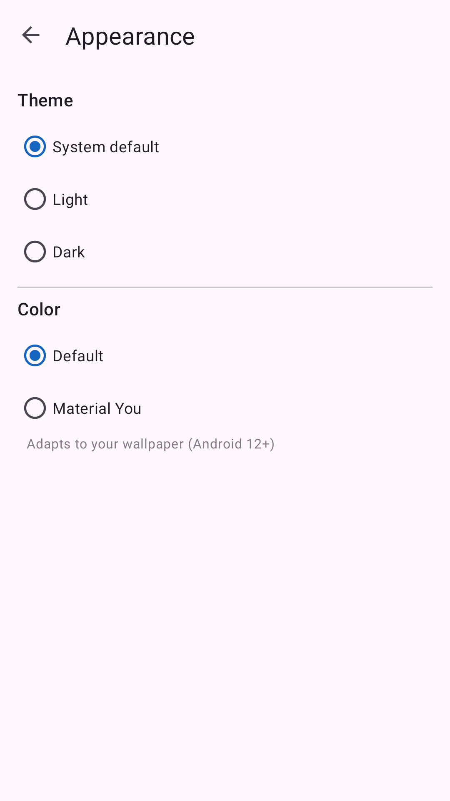

# noti


A deliberately **lightweight**, native-Kotlin Android app that logs your device notifications to
a local database and forwards them, in batches, to a **webhook** you configure (e.g. an
[n8n](https://n8n.io) webhook node). Built to sip battery, CPU, and memory — and to keep
capturing under Doze / aggressive battery optimization.

## Screens

| Status | Settings | Appearance |
|:---:|:---:|:---:|
|  |  |  |

*(Bottom-nav layout — Status / Settings / About. Material 3 with a blue brand theme by default; an
in-app Appearance section toggles Light/Dark/System and Default/Material You color.)*

## Features

- **Captures every notification** via a system-bound `NotificationListenerService` — event-driven,
  no polling, no foreground service, no wakelocks. Survives Doze (verified: notifications posted
  during deep Doze are still captured).
- **Local outbox** — Room/SQLite stores notifications durably so nothing is lost while offline.
- **Batched webhook upload** via WorkManager — deferrable, gzip-optional, with per-record
  success/failure handling and automatic retry.
- **Included-apps allowlist** — pick exactly which apps to capture from a searchable list of
  installed apps (empty = capture all).
- **Duplicate suppression** — apps that re-post the same notification are collapsed by content
  hash within a configurable time window (default 1 day).
- **Privacy controls** — metadata-only mode (drop notification bodies), keyword exclusions
  (e.g. skip anything containing “OTP”), and time-based retention/purge.
- **Flexible triggers** — periodic, threshold (after N pending), or manual; optionally Wi-Fi-only
  and/or charging-only.
- **Configurable auth** — send the token in any header (`Authorization: Bearer …`, or a custom
  header like `key` for n8n Header Auth).

## How it works

```
[System] --onNotificationPosted--> NotiListenerService --redact/dedupe--> Room DB (outbox)
                                                                              |
                                          WorkManager (deferrable job) -------+--> JSON POST
                                                                                     |
                                                            <auth-header>: <token>   |
                                                                                     v
                                                                          Your webhook (n8n)
```

- **Capture** — `NotificationListenerService` is bound and kept alive **by the system**, so it
  works without a foreground service or wakelock. This is the single biggest battery win.
- **Storage** — a Room table acts as an outbox (`uploaded` flag); a content-hash column powers
  time-windowed duplicate detection.
- **Upload** — a `CoroutineWorker` pulls pending rows, POSTs them in batches, and reconciles the
  response per-record. Deferred into Doze maintenance windows and constraint-aware.

**Why push to a webhook instead of hosting an on-device API?** A phone behind carrier/NAT isn’t
reliably reachable, and holding an inbound socket open fights Doze and drains battery. Outbound
batched pushes are the battery-optimal topology.

## Install

Grab the latest signed APK from **[Releases](https://github.com/dkadavarath/noti/releases/latest)**
(`noti-vX.Y.apk`) and sideload it:

```
adb install noti-v1.7.apk
```

Google Play Protect may warn on a sideloaded app that reads notifications — choose *Install anyway*
/ *Install without scanning*. Updates install in place (same signing key), preserving your data.

## Configure on device

The app has three tabs: **Status**, **Settings**, and **About**.

1. **Grant access** (Status tab) — tap *Grant notification access* and enable noti in the system
   list. Tap *Ignore battery optimization* so uploads run reliably. *Sync now* and the captured/pending
   counts also live here.
2. **Webhook** (Settings → Connection) — enter your **Webhook URL** and **auth token**. By default the
   token is sent as `Authorization: Bearer <token>`. For an **n8n Header Auth** credential, set
   *Auth header name* to `key` and clear the *Token prefix* so the raw token is sent as `key: <token>`.
   Tap the eye icon to reveal the token. Prefer an **https** URL — content is sensitive.
3. **Choose apps** (Settings → Apps) — pick which apps to capture; leave empty to capture all.
4. **Tune** — Settings → *Sync* (triggers, Wi-Fi/charging), *Privacy* (metadata-only, keywords,
   duplicate window, retention), and *Appearance* (theme mode + Default/Material color).

## Webhook contract

```
POST <webhook_url>
<auth-header>: <auth-value>          # e.g. "Authorization: Bearer <token>" or "key: <token>"
Content-Type: application/json
Content-Encoding: gzip               # only when gzip is enabled in Settings

{ "batch": [ { "device_id","uid","package","app_label","post_time","title","text",
               "big_text","sub_text","category" } ] }
```

`post_time` is an ISO-8601 UTC string; `uid` is stable and unique (ideal as a primary key for
idempotent inserts). The endpoint should reply **HTTP 200** with per-uid results:

```
[ { "success": ["<uid>", ...], "failure": ["<error message containing the uid>", ...] } ]
```

The app **deletes only uids listed in `success`**; anything else in the batch stays pending and is
retried, with the user alerted about genuine failures. A `… already exists` failure is treated as
success (the record is already stored). Non-2xx: 5xx/network → silent retry; 4xx → alert + retry
(usually an auth/URL problem).

## Build from source

Requires JDK 17 and the Android SDK (compileSdk 35).

```
./gradlew assembleDebug            # debug APK
./gradlew assembleRelease          # R8 full-mode + resource shrinking (needs keystore.properties)
```

Release signing reads a gitignored `keystore.properties` (`storeFile`, `storePassword`, `keyAlias`,
`keyPassword`); without it, `assembleDebug` still works.

## Testing

```
./gradlew testDebugUnitTest          # JVM: redaction, payload, uploader, content-hash, dedup logic
./gradlew connectedDebugAndroidTest  # instrumented: Room DAO, upload pipeline, migration, dedup, …
```

There is also an opt-in live test against a real webhook (skipped unless a URL is supplied, so it
never leaks secrets):

```
KEYB64=$(printf %s '<token>' | base64 -w0)
./gradlew connectedDebugAndroidTest \
  -Pandroid.testInstrumentationRunnerArguments.class=com.noti.logger.LiveWebhookTest \
  -Pandroid.testInstrumentationRunnerArguments.webhookUrl='https://host/webhook/<id>' \
  -Pandroid.testInstrumentationRunnerArguments.authHeaderName=key \
  -Pandroid.testInstrumentationRunnerArguments.authKeyB64="$KEYB64"
```

## Security

- **TLS by default** — `network_security_config.xml` requires https for webhooks; cleartext is
  permitted only for loopback/emulator (local testing). To use a plain-http LAN webhook, add its
  host to that file.
- **No backup exfiltration** — `allowBackup=false` + data-extraction rules keep the notification DB
  and the auth token off cloud backup / device transfer.
- **Secrets at rest** — webhook URL and token live in `EncryptedSharedPreferences`.
- **Minimize sensitive capture** — use metadata-only mode and keyword exclusions to avoid storing
  OTPs / banking messages; the webhook response body read is size-capped to guard against a hostile
  endpoint.

> ⚠️ This app reads and forwards notification content. Only install it on a device whose owner has
> given informed consent. Capturing another person’s notifications without their knowledge is
> illegal in most jurisdictions.

## Tech stack

Kotlin · Material 3 (Views) · Room · WorkManager · Kotlin Coroutines · kotlinx.serialization ·
`HttpURLConnection` · EncryptedSharedPreferences · AndroidX SplashScreen. No Compose, OkHttp, or
DI framework — kept intentionally small (~2.5 MB release APK).

### Project layout (`app/src/main/kotlin/com/noti/logger/`)

| Package | Responsibility |
|---|---|
| `capture/` | `NotiListenerService` — capture, redact, dedupe, insert |
| `data/` | Room `NotificationEntity` / `Dao` / `NotiDatabase` (+ migrations) |
| `redact/` | `RedactionRules` — allowlist, keyword drop, metadata-only |
| `upload/` | `PayloadModels`, `Uploader` (HttpURLConnection + gzip), response parsing |
| `work/` | `UploadWorker`, `UploadScheduler` (triggers + constraints) |
| `config/` | `Settings` (EncryptedSharedPreferences) |
| `util/` | `AppLabelCache`, `InstalledApps`, `ContentHash` |
| `alert/` | `Alerter` — in-app upload-failure notifications |
| `ui/` | `MainActivity` (bottom-nav host) + Status/Settings/About fragments; Connection/Sync/Privacy/Appearance/AppPicker/Help screens |
| `boot/` | `BootReceiver` — re-arm periodic work after reboot |
```
